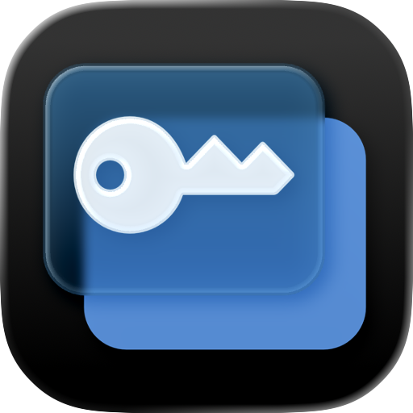
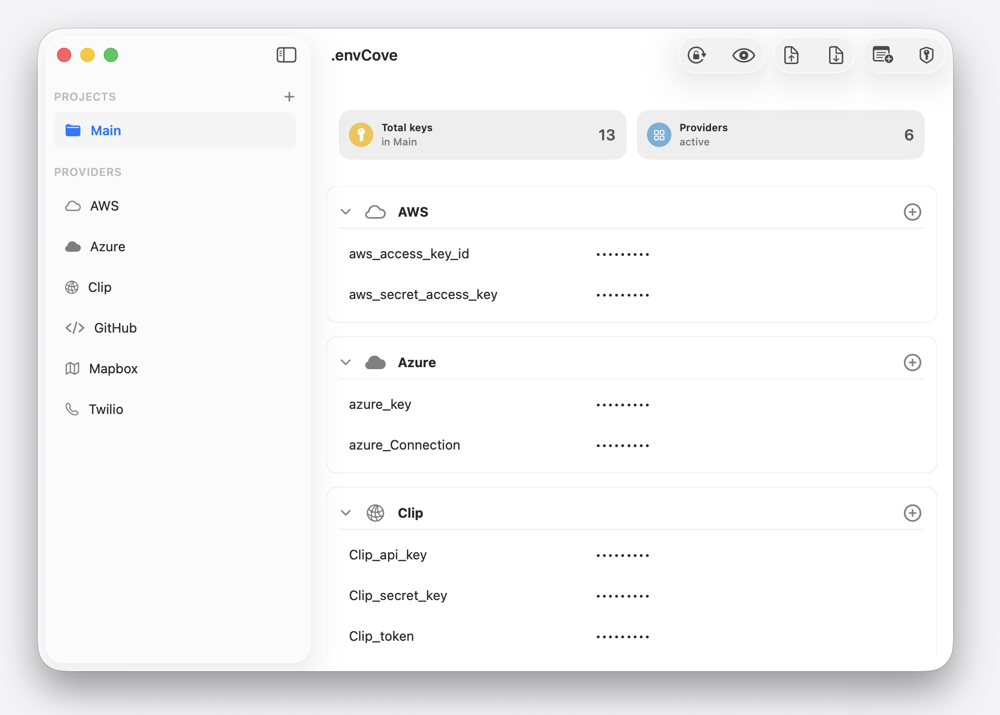

# .envCove


<p align="center">
  
</p>


A native macOS app for managing API keys and secrets, organized by project and provider. All secret values are stored exclusively in the macOS Keychain and access is gated behind Touch ID / biometric authentication.

[](https://danielbustillos.github.io/envcove/)


---

## Features

- **Touch ID lock screen** — the app requires biometric authentication on launch. Sensitive operations (revealing values, exporting) require re-authentication.
- **Projects/Providers** — organize secrets into multiple named workspaces or API providers.
- **Dashboard** — per-project cards showing total key count and provider count.
- **Reveal / hide all** — toolbar toggle to show all values at once (requires Touch ID).
- **Copy to clipboard** — hover over a row to reveal copy buttons.
- **Add / Edit / Delete** — full CRUD for secrets, providers, and projects.
- **Export and import `.env`** — saves all keys as `KEY=VALUE` lines (Touch ID required).
- **Export import JSON** (`⌘⇧E`) — structured JSON export with project, provider, key, and value (Touch ID required).
- **Custom provider icons** — pick from 36 SF Symbol options for custom providers.



---

## Security Model

SecretManager deliberately separates **metadata** from **secret values**:

| What | Where stored |
|---|---|
| Project names, key names, provider info | `~/Library/Application Support/SecretManager/projects.json` |
| Secret values | macOS **Keychain** only — never written to disk in plaintext |

Secret values are loaded into memory only after a successful Touch ID authentication and are flushed back to the Keychain whenever the app goes to background or terminates.

Value masking uses a fixed-length string (`•••••••••`) regardless of the actual secret length to avoid leaking length information.


---

## Requirements

- macOS 13.0 (Ventura) or later
- Mac with Touch ID (or a paired Apple Watch for authentication)
- Xcode 15+

---

## Architecture

The app follows a **single-store, reactive pattern** with unidirectional data flow.

```
SecretManagerApp (@main)
└── RootView                  — auth gate + NavigationSplitView
    ├── SidebarView           — Projects & Providers lists
    └── DetailView            — Secret rows, sheets (add/edit/import/export)
```

| Layer | Type | Role |
|---|---|---|
| `AppStore` | `@MainActor ObservableObject` | Single source of truth; all state and mutation logic |
| `AuthManager` | `@MainActor ObservableObject` | Biometric auth via `LocalAuthentication` |
| `KeychainStore` | `struct` | Wraps `Security` framework; one Keychain blob per project |
| Models | `Codable struct` | `Project`, `SecretEntry`, `ProviderPreset`, `ExportModels` |
| Views | `SwiftUI View` | Observe `AppStore`; receive `AuthManager` via `@EnvironmentObject` |

---

## Project Structure

```
secret_manager/
├── envCove.xcodeproj/
├── Sources/
│   ├── App/            — entry point, root view, scene lifecycle
│   ├── Components/     — reusable UI primitives
│   ├── Models/         — Codable data types
│   ├── Services/       — AppStore, AuthManager, KeychainStore
│   ├── Theme/          — design tokens and color palette
│   ├── Utilities/      — notifications, debug logger
│   └── Views/
│       ├── Detail/     — main pane, provider headers, secret rows
│       └── Sidebar/    — project list, provider filter list
├── Assets.xcassets/
├── docs/               — static marketing/landing page
├── project.yml         — XcodeGen project definition
└── Info.plist
```

---

## Dependencies

**None.** Only Apple system frameworks are used:

- `SwiftUI` / `AppKit`
- `Foundation`
- `LocalAuthentication`
- `Security`

No Swift Package Manager packages, CocoaPods, or Carthage.

---

## Getting Started

### Option A — Download the app (recommended)

1. Go to the [Releases page](https://github.com/DanielBustillos/envcove/releases).
2. Download the latest `.app` from the Assets section.
3. Move `.envCove.app` to your `/Applications` folder and open it.

> macOS may show a security prompt on first launch. Go to **System Settings → Privacy & Security** and click **Open Anyway**.

### Option B — Build from source

1. Clone the repository.
2. Open `envCove.xcodeproj` in Xcode (or regenerate it with [XcodeGen](https://github.com/yonaskolb/XcodeGen): `xcodegen generate`).
3. Select the `SecretManager` scheme and your Mac as the run destination.
4. Build and run (`⌘R`).

No additional setup is required — the app creates its data directory automatically on first launch.tomatically on first launch.

---

## License

This project is released under the [MIT License](LICENSE).
